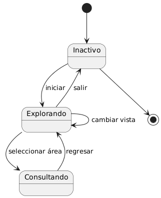
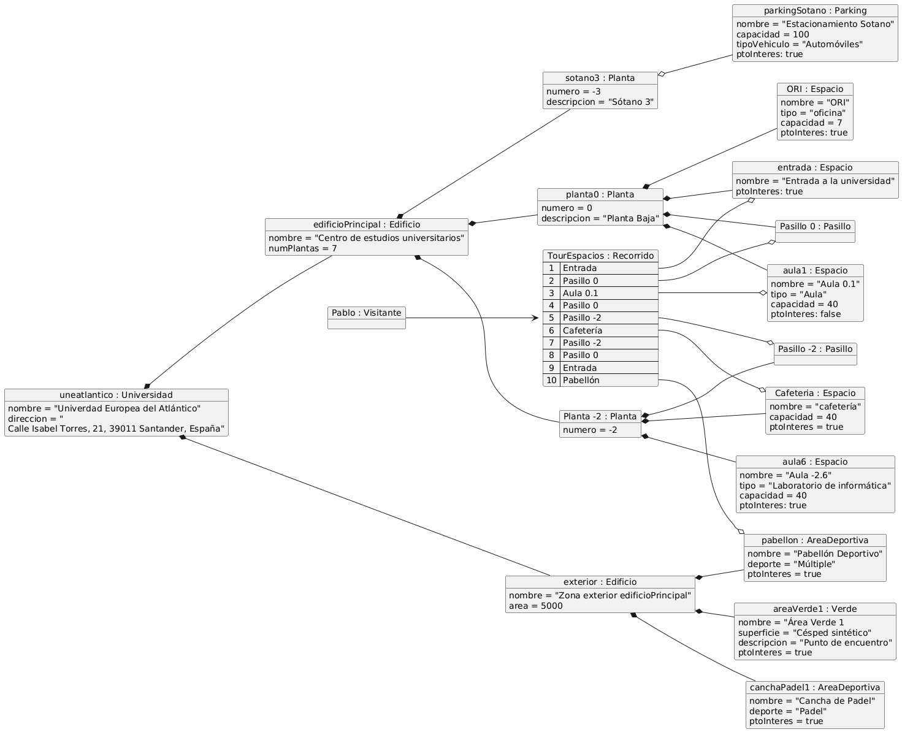

# Modelo de dominio

|          
|:-:|

## Información del artefacto

- **Proyecto**: myUniverse - Aplicación móvil con mapa 3D interactivo del campus
- **Fase RUP**: Inception (Inicio)
- **Versión**: 1.0
- **Fecha**: 2025-11-23
- **Autor**: Equipo myUniverse

## Introducción

Este documento describe el modelo conceptual del dominio para `myUniverse`. Define el vocabulario común y las relaciones entre las entidades que componen la aplicación: campus, edificios, aulas, servicios y puntos de interés. Está pensado para guiar el diseño de la API, la estructura de datos y los casos de uso de la aplicación móvil.

## Propósito

- Establecer un vocabulario compartido para el proyecto `myUniverse`
- Definir las entidades principales del dominio espacial y de servicios del campus
- Documentar las relaciones conceptuales entre entidades
- Servir como base para casos de uso, prototipos y la implementación del mapa 3D

## Problema que resuelve

La aplicación busca ayudar a estudiantes y visitantes a orientarse y acceder a la información del campus mediante:

1. **Localización precisa** - Mostrar posición y rutas en un mapa 3D del campus
2. **Información de espacios** - Acceder a datos de aulas, servicios y recursos disponibles
3. **Disponibilidad y eventos** - Mostrar horarios, disponibilidad y eventos en instalaciones

## Consideraciones de Diseño

### Simplicidad conceptual

- El modelo prioriza conceptos claros y reutilizables: `Edificio`, `Aula`, `Espacio`, `Planta`
- Evita detalles técnicos de renderizado 3D; define contratos y datos necesarios para la vista (coordenadas, capas, metadatos)

## Diagrama de Clases

|  |
|:-:|
| [Código fuente](./DiagramaDeClases/diagramaDeClases.puml) |

## Diagrama de Estados

### Espacio

|  |
|:-:|
| [Código fuente](./DiagramaDeEstados/DdEEspacio/diagramaDeEstados.puml) |

### Visitante

|  |
|:-:|
| [Código fuente](./DiagramaDeEstados/DdEVisitante/diagramaDeEstados.puml) |

### Recorrido

|  |
|:-:|
| [Código fuente](./DiagramaDeEstados/DdEspacioRecorrido/diagramaDeEstado.uml) |

## Diagrama de Objetos

|  |
|:-:|
| [Código fuente](./DiagramaDeObjetos/diagramaDeObjetos.uml) |

