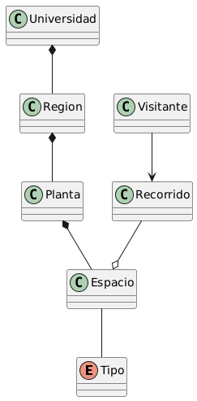
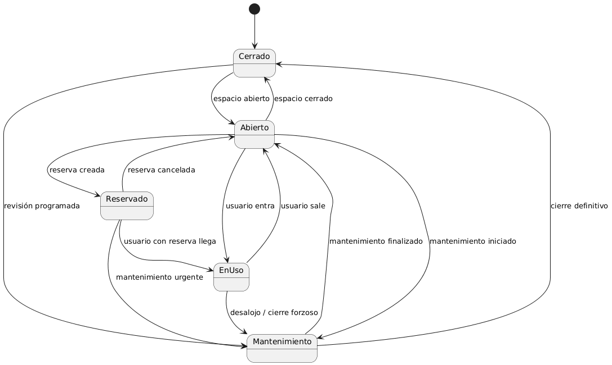
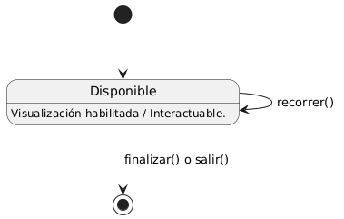

# Modelo de dominio

|            |
|:-:|

## Diagrama de Clases

|  |
|:-:|
| [Código fuente](./DiagramaDeClases/diagramaDeClases.puml) |

---

## Diagrama de Estados

### Espacio

|  |
|:-:|
| [Código fuente](./DiagramaDeEstados/DdEEspacio/diagramaDeEstados.puml) |

### Visitante

|  |
|:-:|
| [Código fuente](/documentos/00-modeloDeDominio/DiagramaDeEstados/DdEVisitante/diagramaDeEstados.puml) |

### Recorrido

|  |
|:-:|
| [Código fuente](/documentos/00-modeloDeDominio/DiagramaDeEstados/DdEspacioRecorrido/diagramaDeEstado.uml) |

---

