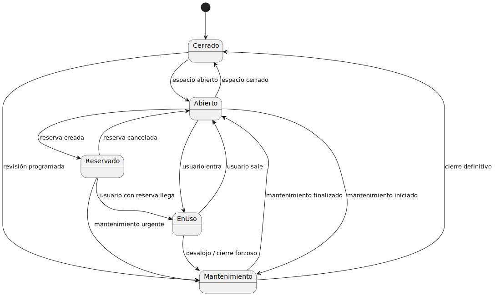
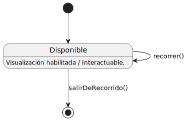
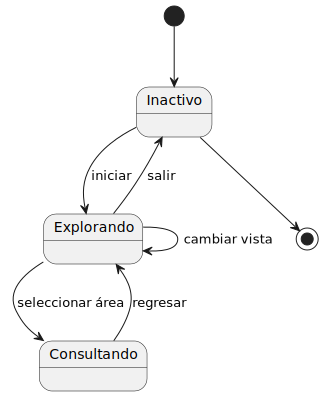
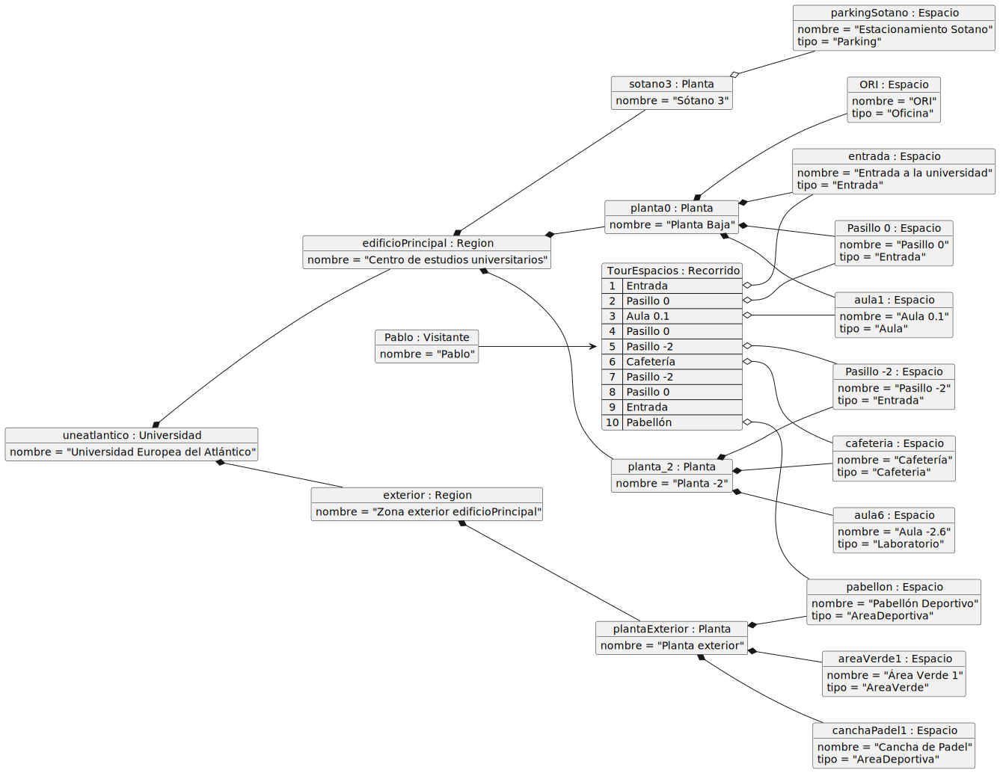

# Modelo del dominio

|||||
|-|-|-|-|
|[Inicio](/README.md)|**Modelo del dominio**|[Casos de uso](/documentos/01-casoDeUso/0-Actores/README.md)

## Diagrama de Clases

|
|:-:
|Código fuente: [diagrama-clases.puml](/documentos/00-modeloDeDominio/DiagramaDeClases/diagramaDeClases.puml)

## Diagrama de Estados

||||
|:-:|:-:|:-:|
|||
|Código fuente:[ Espacio](./DiagramaDeEstados/DdEEspacio/diagramaDeEstados.puml)|Código fuente: [Recorrido](./DiagramaDeEstados/DdEspacioRecorrido/diagramaDeEstados.uml)|Código fuente: [Visitante](./DiagramaDeEstados/DdEVisitante/diagramaDeEstados.puml)

## Diagrama de Objetos

|
|:-:
|Código fuente: [diagrama-objetos.puml](./DiagramaDeObjetos/diagramaDeObjetos.puml)

