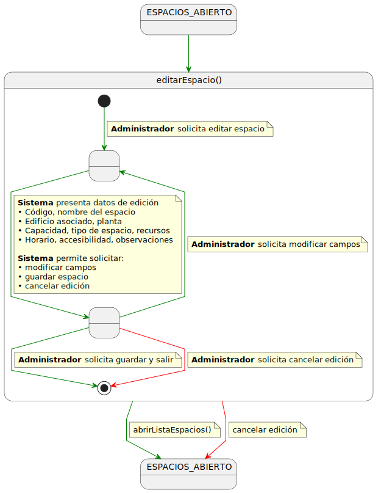

# editarEspacio() -> Detalle y prototipado

## Diagrama de especificación

||
|-|
|Código fuente: [especificacion.puml](../../../3-DetallarCasosDeUso/0-Administrador/editarEspacio/editarEspacio.puml)|

## prototipo de interfaz

### wireframes

#### Pantalla: actualización de espacio

||
|-|

