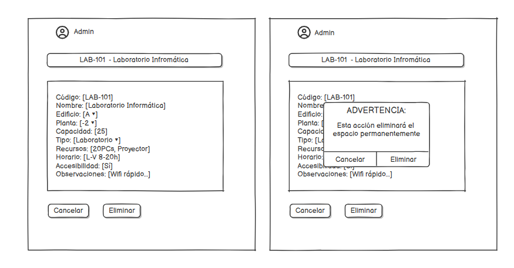

# eliminarEspacio() -> Detalle y prototipado

## Diagrama de especificación

||
|-|
|Código fuente: [especificacion.puml](/documentos/01-casoDeUso/3-DetallarCasosDeUso/0-Administrador/eliminarEspacio/eliminarEspacio.puml)|

## Prototipo de interfaz

### Wireframes

#### Pantalla: eliminar espacios

||
|-|

