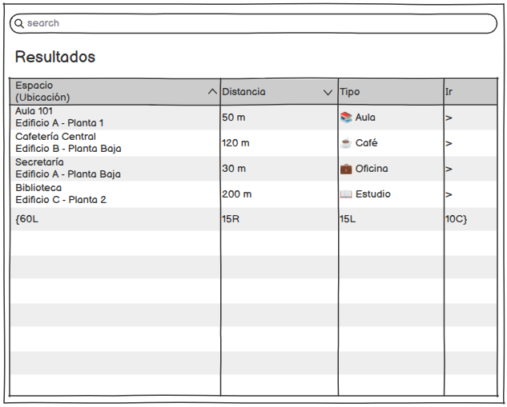

|        
|:-:|

# buscarEspacio() -> Detalle y prototipado

## Diagrama de especificación

||
|-|
|Código fuente: [especificacion.puml](/documentos/01-casoDeUso/3-DetallarCasosDeUso/1-Visitante/buscarEspacio/buscarEspacio.puml)|

## Prototipo de interfaz

### Wireframes

#### Pantalla: Buscar espacio

||
|-|

