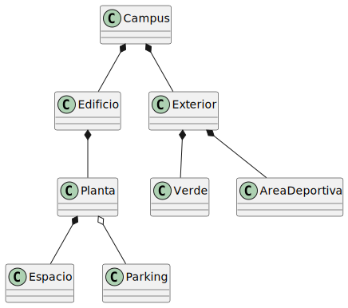
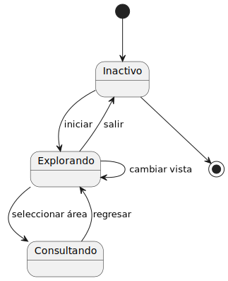

# Modelo de dominio

|          |
|:-:|

## Diagrama de Clases

|  |
|:-:|
| [Código fuente](./DiagramaDeClases/diagramaDeClases.puml) |

---

## Diagrama de Estados

|  |
|:-:|
| [Código fuente](./DiagramaDeEstados/diagramaDeEstados.puml) |

